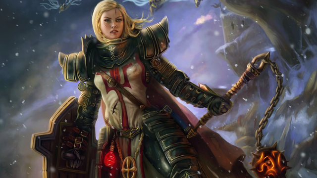
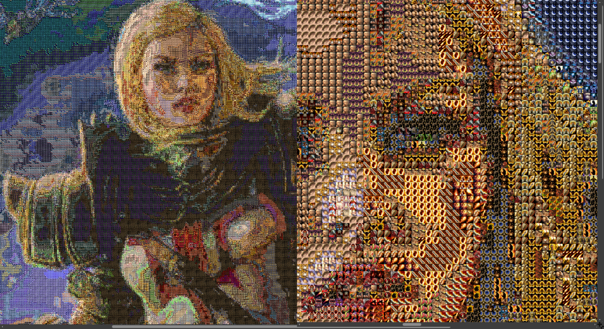

wowiconify
==========
wowiconify takes a source input image and number of WOW spell icons and then produces
and output image where every pixel from the source input image is approximated by a
WOW spell icon.

Sound complicated and confusing? Here's an image, which is supposed to be worth
no more and no less than 1000 words.

### Source Input Image


### Output Image (click for hires)
[](test_out.png)

Getting Started
---------------
This is highly unoptimized and was thrown together in a couple of hours just for
funsies. Keep that in mind before you use any of it in a _production_ setting.

### Linux/macOS
```bash
$ cc -O3 -lm wowiconify.c -o wowiconify
$ ./wowiconify out.png test.png spells/*.png
```

### Windows
VS 2019 and later.

```bash
$ cl /O2 wowiconify.c /link /out:wowiconify.exe
$ wowiconify out.png test.png spells/*.png
```

Credits
-------
* [4300+ WoW Retail Icons][1] by [barrens.chat][2]

Contribute
----------
* Fork the project.
* Make your feature addition or bug fix.
* Do **not** bump the version number.
* Create a pull request. Bonus points for topic branches.

License
-------
Copyright (c) 2021, Mihail Szabolcs

**wowiconify** is provided **as-is** under the **MIT** license.
For more information see LICENSE.

[1]: https://www.warcrafttavern.com/community/art-resources/icon-pack-4300-wow-retail-icons-in-png/
[2]: https://barrens.chat/
